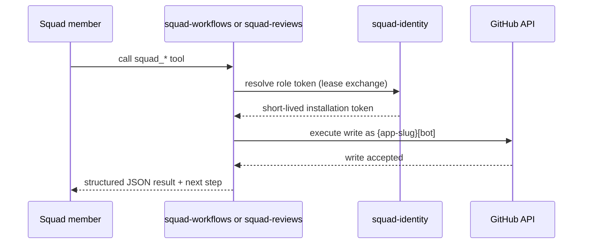
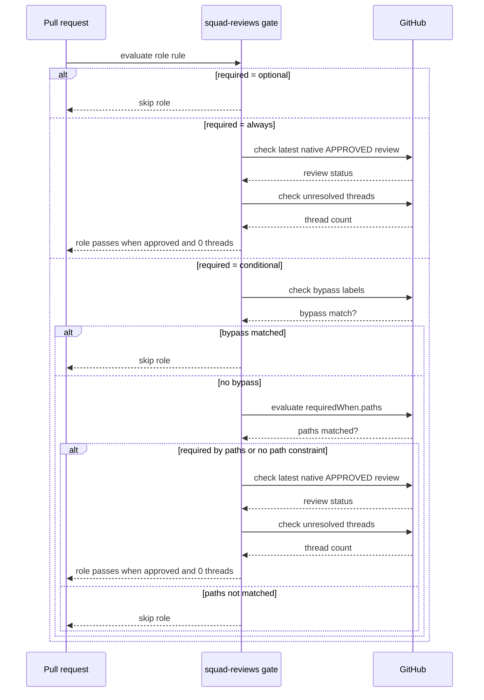
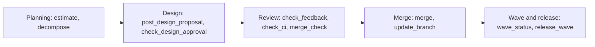

For the last month, I have been running multiple developer teams in terminals in the corner of my screen, and I have not been this excited to code in years. Most days with a longer list of ideas than I started with.

The framework underneath it is [Squad](https://github.com/bradygaster/squad), an open-source project for persistent, role-based team members inside Copilot CLI. Squad gives you a roster of roles with explicit handoffs between them. That solves coordination. It does not, on its own, answer the questions a human reviewer or auditor will eventually ask.

To close that gap, I wrote three companion Copilot CLI extensions: [squad-identity](https://github.com/sabbour/squad-identity), [squad-reviews](https://github.com/sabbour/squad-reviews), and [squad-workflows](https://github.com/sabbour/squad-workflows). This post is a tour of how they fit together in practice, what governance they actually enforce, where the model gets fast, and where it still strains.

## What Squad gives you on its own

Before the extensions, it helps to know what stock Squad already does. You drop a `.squad/` directory into your repository and check it in. Inside, you describe a roster of roles with charters and handoff rules. Each role is a markdown file Copilot CLI loads as part of the session, so when you open Copilot in that repo, the agent knows it can act as a back-end engineer, front-end engineer, architect, security reviewer, code reviewer, docs writer, DevOps engineer, or tester, plus a memory keeper and a queue manager. The exact roster is yours to shape: rename, add, remove, or rewrite charters to fit your project.

That alone gives you a lot. You get role-aware prompting, persistent context across sessions through the memory role, an explicit queue the queue manager picks from, and a vocabulary your team and the agents both share. For prototyping and small projects, plain Squad is often all you need.

What plain Squad does not give you is enforcement. The roles are conventions, not constraints. Anyone (or any agent) can push as you, approve their own pull request, mark a review as done without reading the diff, or merge straight to `main` while skipping every gate. The charters are advisory text. 

GitHub doesn't know about them, other people don't know about them, and it just starts to get weird talking to yourself.

## Three questions, three extensions

This got me thinking, how can I answer:

1. Who authored this GitHub write?
2. Which reviewer role approved this change?
3. What lifecycle state is this work in right now?

And as a result, I came up with three  companion Copilot CLI extensions: [squad-identity](https://github.com/sabbour/squad-identity), [squad-reviews](https://github.com/sabbour/squad-reviews), and [squad-workflows](https://github.com/sabbour/squad-workflows).

## The stack

I think of this as layered control with explicit tools. Copilot CLI is the foundation. Squad members run on top and decide who should do work. 

The extensions do two jobs at the same time: they contribute prompt and charter updates that shape member behavior, and they expose tools members can call through Copilot CLI. Those tools enforce state checks, validate governance rules, and ensure every action is traceable.

This tool-based approach is what makes the process deterministic: an agent cannot bypass a merge check, skip a review gate, or push without bot identity resolution. The rules are encoded in tool behavior, not in external policy or honor system.

## Layer 1: Bot identities with squad-identity

Under the hood, this extension resolves credentials through GitHub App authentication:

- Maps role aliases, such as backend, frontend, security, codereview, docs, and devops, to app registrations.
- Signs an app JWT, exchanges it for an installation token, and caches it only until close to expiration.
- Loads credentials from CI variables or local keychain.

Every write across the stack flows through this same pattern: workflow and review tools call into [squad-identity](https://github.com/sabbour/squad-identity) for token resolution, then execute GitHub writes as role-specific bots.

That gives you traceable authorship and constrained blast radius for automated writes.

## Layer 2: Review governance with squad-reviews

[squad-reviews](https://github.com/sabbour/squad-reviews) formalizes review responsibility by role. Instead of ad hoc approvals, each pull request routes through configured reviewer dimensions with explicit pass conditions.

The feedback loop is strict in a good way. Unresolved thread handling requires a reply and then resolution. You cannot quietly dismiss feedback and move on.

The gate logic itself is explicit and config-driven, so an agent can predict the verdict before posting:

## Layer 3: Lifecycle orchestration with squad-workflows

[squad-workflows](https://github.com/sabbour/squad-workflows) drives issue-to-merge lifecycle state as executable tools.

A typical path looks like this:

1. **Estimate** work size.
2. Decompose L or XL work into waves.
4. Post **design proposal** when required.
5. Wait for **design approval** labels.
6. Implement, open pull request, and run **review** gates.
8. Merge and advance wave status.

The lifecycle maps cleanly onto tool categories with deterministic progression:

This creates clear state transitions that humans and agents both understand.

## Watching the team work

Numbers aside, the part I did not expect to enjoy this much is just watching the interactions unfold. The architect posts a design proposal. The back-end role pushes a draft and pings security with a specific concern. Security comes back with three findings, two structural and one nitpick, citing exact file ranges. Code review chimes in on the fixture coverage. Docs flags a missing changelog entry. The back-end role replies on each thread, commits a fix, resolves the threads, and asks the queue manager what's next.

It is like reading a fast-forward of a real engineering team. Different voices, different priorities, all converging on a working pull request in real time. Once you have seen it once, the underlying point of the whole stack stops feeling like governance theater and starts feeling like a small team that actually behaves like one.

## Where the magic thins out

The same evidence shows where this model strains. **Squad runs hottest when agents talk to each other through Squad-native loops**: inbox files, append-only logs, the workflow extension, the reviews extension. The overnight sprint that shipped 19 issues and 26 pull requests in roughly 8 hours lived almost entirely inside that loop, it was like a team sitting in the same room.

The counter-example is when work has to step out of it. Across the last 30 merged pull requests, pull requests **had a median open-to-merge time of 3.06 hours** and averaged 8.2 reviews each. About 42% of the bot-authored pull requests hit at least one `CHANGES_REQUESTED` loop.

The root cause is structural, and three patterns show up over and over:

- **Rebase cascade.** Branch protection requires branches to stay current. Every merge into `dev` puts other open pull requests `BEHIND`. After a rebase, approval labels can strip, reviewers must verify what is functionally unchanged, and the gate runs again. One merge can invalidate many pull requests at once.
- **Per-thread ceremony.** Every review thread requires read, act or dismiss, reply, then resolve via GraphQL. That is correct hygiene for human auditability, but for bot-to-bot traffic it turns one finding into a code commit, a reply comment, a resolve mutation, and often a follow-up gate run.
- **The queue-manager loop needs a human nearby.** The whole system runs from a local Copilot CLI session. The queue-manager/monitor role, _Ralph_, does the scanning and routing, but the loop is not fully hands-off. The console occasionally stalls, asks for confirmation, or sits idle waiting for a nudge to pick up the next item. You sometimes end up babysitting the terminal to keep throughput up, which is fine for a side project and awkward for anything that should run unattended overnight.

None of that is an argument against review gates or human-readable pull requests. The gates catch real bugs. It is an argument that the middle ground is underbuilt. Squad currently optimizes one end (fully agent-native, very fast) and accepts the other (fully GitHub-native, much slower).

## The waterfall trap

There is a failure mode about how I work with the agents.

Scott Hanselman and Mark Russinovich described **iterative "sculpting" with AI** on a recent [Hanselminutes episode](https://www.youtube.com/watch?v=IZRWzXjaXxM): you prompt, see output fast, react, refine, and shape the result hands-on. That style works beautifully with Squad too. It is how I started most of my prototypes: small prompt, quick artifact, look at it, adjust, go again.

The risk is that **the more structure you add** (charters, gates, design proposals, review dimensions, lifecycle phases) **the easier it gets to slip into a big-batch waterfall**. I have done this more than once. I leave Squad churning over a feature overnight and in the morning, I open the repo to a forest of design proposals, reviewer comments, 10s of open and merged pull requests, and nothing I can actually look at. The process worked, **the board looks impressive, but the thing itself is not demoable**.

The trick is to keep educating the squad team to **ship in small, demoable waves**. Estimate down. Decompose aggressively. Prefer something I can open in a browser at the end of every wave, even if it is rough, over a complete-on-paper backend with no surface yet. The system rewards small batches though you have to actually ask for them.

## Tools designed for human speed

Most of the friction above comes down to one thing: **we're using tools and processes that were designed for humans, at human speed**. Reviews, labels, threaded comments, and check-run rollups all assume a person who reads, thinks, types, and clicks once every few minutes. Agents do that loop in seconds, and they do it in parallel. When you point a team of bots at an interface tuned for a human reviewer's tempo, every small impedance mismatch (label strip on rebase, one-thread-at-a-time resolution, eventually-consistent check rollups) compounds into the latency I described above.

## Wrapping up

I opened this post saying Squad turns Copilot CLI into a small software team you can put to work while you sleep. The honest update, a month in, is that I am not sleeping much. I keep one eye on the terminal because it is genuinely fun to watch, and because every wave teaches me something about where the gates hold and where the seams are. I have not been this excited to code in years, the kind of excited where I open the laptop before coffee to see what shipped overnight, and then spend an hour reviewing pull requests I did not write but somehow feel responsible for.